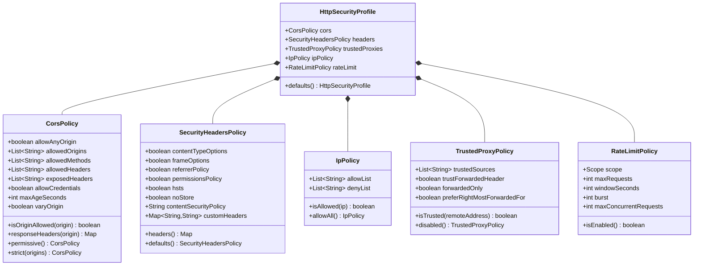

# ether-http-security

Portable, immutable HTTP security policy records for the Ether framework. All types are Java 21 records; transport adapters (Jetty, Netty, etc.) consume the policies and apply them to server-specific mechanisms.

## Maven Dependency

```xml
<dependency>
    <groupId>dev.rafex.ether.http</groupId>
    <artifactId>ether-http-security</artifactId>
    <version>8.0.0-SNAPSHOT</version>
</dependency>
```

## Overview

Security is declared as data, not as imperative code. Every policy is an immutable record that describes what the server should do; the adapter translates that into filters, headers, and access-gate decisions at runtime.

The five policy records compose into a single `HttpSecurityProfile`, which becomes the one configuration object the transport adapter needs.

---

## `HttpSecurityProfile` Composition



---

## Policy Records

### `CorsPolicy`

Controls Cross-Origin Resource Sharing headers. Two convenience factories cover the common cases; arbitrary policies can be constructed directly.

| Field | Type | Description |
|---|---|---|
| `allowAnyOrigin` | `boolean` | If true, reflects `*` for `Access-Control-Allow-Origin` |
| `allowedOrigins` | `List<String>` | Explicit origin whitelist (ignored when `allowAnyOrigin` is true) |
| `allowedMethods` | `List<String>` | HTTP methods to declare in CORS response |
| `allowedHeaders` | `List<String>` | Request headers the browser is allowed to send |
| `exposedHeaders` | `List<String>` | Response headers the browser is allowed to read |
| `allowCredentials` | `boolean` | If true, adds `Access-Control-Allow-Credentials: true` |
| `maxAgeSeconds` | `int` | Preflight cache duration in seconds |
| `varyOrigin` | `boolean` | Adds `Vary: Origin` to prevent caching across origins |

`responseHeaders(origin)` computes the full set of CORS headers for a given request origin and is used directly by the transport adapter.

### `SecurityHeadersPolicy`

Controls the security-related response headers that harden the browser's behaviour.

| Field | Generated Header | Value |
|---|---|---|
| `contentTypeOptions` | `X-Content-Type-Options` | `nosniff` |
| `frameOptions` | `X-Frame-Options` | `DENY` |
| `referrerPolicy` | `Referrer-Policy` | `no-referrer` |
| `permissionsPolicy` | `Permissions-Policy` | `geolocation=(), microphone=(), camera=()` |
| `hsts` | `Strict-Transport-Security` | `max-age=31536000; includeSubDomains` |
| `noStore` | `Cache-Control` | `no-store` |
| `contentSecurityPolicy` | `Content-Security-Policy` | Configurable string |
| `customHeaders` | any | Added verbatim after the above |

`headers()` returns the full map of headers to set on every response.

### `IpPolicy`

A coarse IP-based access gate evaluated before route handling. If `allowList` is empty and `denyList` is empty, all IPs are allowed. If `allowList` is non-empty, only listed IPs (prefix match) pass. `denyList` always takes precedence over `allowList`.

### `TrustedProxyPolicy`

Declares which upstream proxies are trusted to set `X-Forwarded-For` headers. The transport adapter uses this to resolve the real client IP before `IpPolicy` evaluates it.

### `RateLimitPolicy`

Declares the desired rate limiting behaviour. The transport adapter is responsible for implementing the algorithm (fixed-window, token bucket, etc.) and for choosing the storage backend (in-memory per JVM or distributed via Redis).

| Field | Description |
|---|---|
| `scope` | `GLOBAL` (total across all clients) or `PER_IP` |
| `maxRequests` | Maximum requests allowed per window |
| `windowSeconds` | Length of the time window in seconds |
| `burst` | Additional requests allowed to burst over the limit |
| `maxConcurrentRequests` | Maximum simultaneous in-flight requests (0 = disabled) |

`isEnabled()` returns `true` when `maxRequests > 0` and `windowSeconds > 0`.

---

## Examples

### 1. Configure strict CORS for a production API

```java
import dev.rafex.ether.http.security.cors.CorsPolicy;
import java.util.List;

// Allow only the production and staging front-ends.
// allowCredentials must be false when allowAnyOrigin is false and you
// want cookie-based sessions; set to true for JWT-in-header flows.
var cors = CorsPolicy.strict(List.of(
    "https://app.example.com",
    "https://staging.example.com"
));

// For local development, open CORS completely (never use in production):
var devCors = CorsPolicy.permissive();

// Inspect what headers will be sent for a given origin:
var origin = "https://app.example.com";
var headers = cors.responseHeaders(origin);
// headers = {
//   Access-Control-Allow-Origin  → https://app.example.com
//   Access-Control-Allow-Methods → GET, POST, PUT, PATCH, DELETE, OPTIONS, HEAD
//   Access-Control-Allow-Headers → content-type, authorization
//   Access-Control-Max-Age       → 3600
//   Vary                         → Origin
// }

System.out.println("Origin allowed: " + cors.isOriginAllowed(origin));       // true
System.out.println("Origin allowed: " + cors.isOriginAllowed("https://evil.io")); // false

// Build a fully custom CORS policy:
var customCors = new CorsPolicy(
    false,
    List.of("https://api.partner.com"),
    List.of("GET", "POST", "OPTIONS"),
    List.of("Content-Type", "Authorization", "X-Request-Id"),
    List.of("X-Rate-Limit-Remaining"),
    true,  // allowCredentials
    600,   // maxAgeSeconds
    true   // varyOrigin
);
```

---

### 2. Configure all security headers

```java
import dev.rafex.ether.http.security.headers.SecurityHeadersPolicy;
import java.util.Map;

// Use the opinionated defaults — suitable for most REST APIs.
var defaultHeaders = SecurityHeadersPolicy.defaults();

// The defaults() factory produces:
//   X-Content-Type-Options: nosniff
//   X-Frame-Options: DENY
//   Referrer-Policy: no-referrer
//   Permissions-Policy: geolocation=(), microphone=(), camera=()
//   Strict-Transport-Security: max-age=31536000; includeSubDomains
//   Cache-Control: no-store
//   Content-Security-Policy: default-src 'self'; frame-ancestors 'none'; base-uri 'self'

// Apply all headers to a response (pseudo-code — actual call is transport-specific):
defaultHeaders.headers().forEach((name, value) ->
    serverResponse.setHeader(name, value)
);

// Build a custom policy — e.g. a service that serves iframes to a partner:
var relaxedFraming = new SecurityHeadersPolicy(
    true,   // contentTypeOptions
    false,  // frameOptions — omit X-Frame-Options (controlled by CSP instead)
    true,   // referrerPolicy
    true,   // permissionsPolicy
    true,   // hsts
    true,   // noStore
    "default-src 'self'; frame-ancestors https://partner.example.com",
    Map.of(
        "X-Custom-Header",    "my-service",
        "Cross-Origin-Opener-Policy", "same-origin"
    )
);

// Inspect the resulting map:
var headers = relaxedFraming.headers();
System.out.println(headers.get("Content-Security-Policy"));
// → "default-src 'self'; frame-ancestors https://partner.example.com"
System.out.println(headers.get("X-Custom-Header"));
// → "my-service"
```

---

### 3. Configure IP allowlist for admin endpoints

```java
import dev.rafex.ether.http.security.ip.IpPolicy;
import java.util.List;

// Allow only the internal network and a specific DevOps workstation.
// The match is a prefix match: "10.0." matches any 10.0.x.x address.
var adminIpPolicy = new IpPolicy(
    List.of("10.0.", "192.168.1.100", "127.0.0.1"),  // allowList
    List.of()                                          // denyList
);

System.out.println(adminIpPolicy.isAllowed("10.0.5.22"));    // true — matches prefix "10.0."
System.out.println(adminIpPolicy.isAllowed("192.168.1.100")); // true — exact match
System.out.println(adminIpPolicy.isAllowed("203.0.113.5"));   // false — not in allowList

// Block a known abusive CIDR while keeping everything else open:
var blockList = new IpPolicy(
    List.of(),                                    // empty allowList = allow all by default
    List.of("198.51.100.", "203.0.113.")          // denyList takes precedence
);

System.out.println(blockList.isAllowed("198.51.100.7"));  // false — in deny list
System.out.println(blockList.isAllowed("93.184.216.34")); // true — not in deny list

// Use IpPolicy in a middleware (IP resolved via TrustedProxyPolicy):
import dev.rafex.ether.http.core.Middleware;

Middleware ipGate = next -> exchange -> {
    var clientIp = resolveClientIp(exchange); // transport-specific
    if (!adminIpPolicy.isAllowed(clientIp)) {
        exchange.json(403, java.util.Map.of(
            "error", "forbidden",
            "detail", "Your IP address is not permitted"
        ));
        return true;
    }
    return next.handle(exchange);
};
```

---

### 4. Configure rate limiting

```java
import dev.rafex.ether.http.security.ratelimit.RateLimitPolicy;
import dev.rafex.ether.http.security.ratelimit.RateLimitPolicy.Scope;

// Allow 100 requests per minute per IP address, with a burst headroom of 20.
var perIpLimit = new RateLimitPolicy(
    Scope.PER_IP,
    100,  // maxRequests per window
    60,   // windowSeconds
    20,   // burst — extra requests above maxRequests before hard rejection
    0     // maxConcurrentRequests — 0 means no concurrency limit
);

System.out.println(perIpLimit.isEnabled()); // true

// A global limit (total across all clients combined):
var globalLimit = new RateLimitPolicy(
    Scope.GLOBAL,
    5000, // maxRequests per minute for the entire service
    60,
    500,
    200   // never allow more than 200 simultaneous in-flight requests
);

// Disabled (no rate limiting):
var noLimit = new RateLimitPolicy(Scope.GLOBAL, 0, 0, 0, 0);
System.out.println(noLimit.isEnabled()); // false

// Check the policy fields in a middleware (actual counter storage is in the adapter):
if (perIpLimit.isEnabled()) {
    var clientIp = resolveClientIp(exchange);
    // Adapter calls its in-memory or Redis counter here and may reject the request.
}
```

**Note on rate limiting:** The Ether Jetty adapter uses an in-memory fixed-window limiter per JVM instance. It resets on restart and is not shared across replicas. Distributed rate limiting (Redis-backed) is planned for a future release.

---

### 5. Compose a full `HttpSecurityProfile`

```java
import dev.rafex.ether.http.security.profile.HttpSecurityProfile;
import dev.rafex.ether.http.security.cors.CorsPolicy;
import dev.rafex.ether.http.security.headers.SecurityHeadersPolicy;
import dev.rafex.ether.http.security.ip.IpPolicy;
import dev.rafex.ether.http.security.proxy.TrustedProxyPolicy;
import dev.rafex.ether.http.security.ratelimit.RateLimitPolicy;
import java.util.List;
import java.util.Map;

// Production security profile for a public-facing REST API.
var cors = CorsPolicy.strict(List.of(
    "https://app.example.com",
    "https://www.example.com"
));

var securityHeaders = new SecurityHeadersPolicy(
    true,  // X-Content-Type-Options: nosniff
    true,  // X-Frame-Options: DENY
    true,  // Referrer-Policy: no-referrer
    true,  // Permissions-Policy
    true,  // Strict-Transport-Security
    true,  // Cache-Control: no-store
    "default-src 'self'; script-src 'self'; object-src 'none'",
    Map.of("X-Service-Version", "8.0.0")
);

// Trust requests that arrive through our internal load balancer.
var trustedProxies = new TrustedProxyPolicy(
    List.of("10.0.0.", "172.16."),  // trusted load balancer CIDR prefixes
    true,   // trustForwardedHeader
    false,  // forwardedOnly
    true    // preferRightMostForwardedFor
);

// No IP allowlist restrictions on the public API.
var ipPolicy = IpPolicy.allowAll();

// 200 requests/minute per IP, burst up to 50 extra.
var rateLimit = new RateLimitPolicy(
    RateLimitPolicy.Scope.PER_IP,
    200, 60, 50, 0
);

// Combine everything into a single profile.
var profile = new HttpSecurityProfile(cors, securityHeaders, trustedProxies, ipPolicy, rateLimit);

// The transport adapter receives the profile and applies it:
//   adapter.configure(profile);

// For quick prototyping, use the opinionated defaults:
var defaultProfile = HttpSecurityProfile.defaults();
// defaults() → strict CORS (no origins), SecurityHeadersPolicy.defaults(),
//              TrustedProxyPolicy.disabled(), IpPolicy.allowAll(), rate limiting disabled.
```

---

## Notes on Rate Limiting

The current Jetty adapter uses an in-memory per-JVM limiter with a fixed-window algorithm:

- Local to one process — counters are not shared across replicas.
- Counters reset on server restart.
- Not suitable as the sole rate-limiting mechanism behind a load balancer distributing across multiple instances.

For multi-instance deployments, front the service with a gateway (Kong, Envoy, AWS API Gateway) that enforces the limit externally, and keep `RateLimitPolicy` active as a secondary defence.

---

## License

MIT License — Copyright (C) 2025-2026 Raúl Eduardo González Argote
